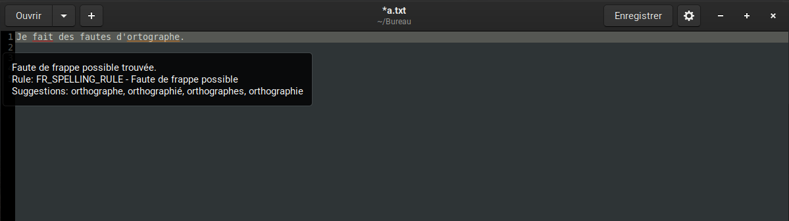

# Language Tool for GEdit

## Enables LT in legacy GEdit.

 

* Quickly enable correction in GEdit
* Configurable server address
* Easy and hackable code

## Installation

```bash
git clone https://github.com/fredele/LTGedit.git
# Create user plugin folder
mkdir -p ~/.local/share/gedit/plugins/
# Copy files to  ~/.local/share/gedit/plugins/
cp -r LTplugin ~/.local/share/gedit/plugins/
```

## Usage

Enable the plugin in Gedit, check "Tools/LT Correction".

Errors are underlined in red.

You can set your LT server in the .ini file manually or with the preference dialog within GEdit.

## Limitations

- Does not add words to dictionary

- Cannot set enabledRules/disabledRules/enabledCategories/disabledCategories

- Cannot set level

## Notes

- LT API : [LanguageTool API documentation](https://languagetool.org/http-api/?ref=public_apis)

## License

No License at all
